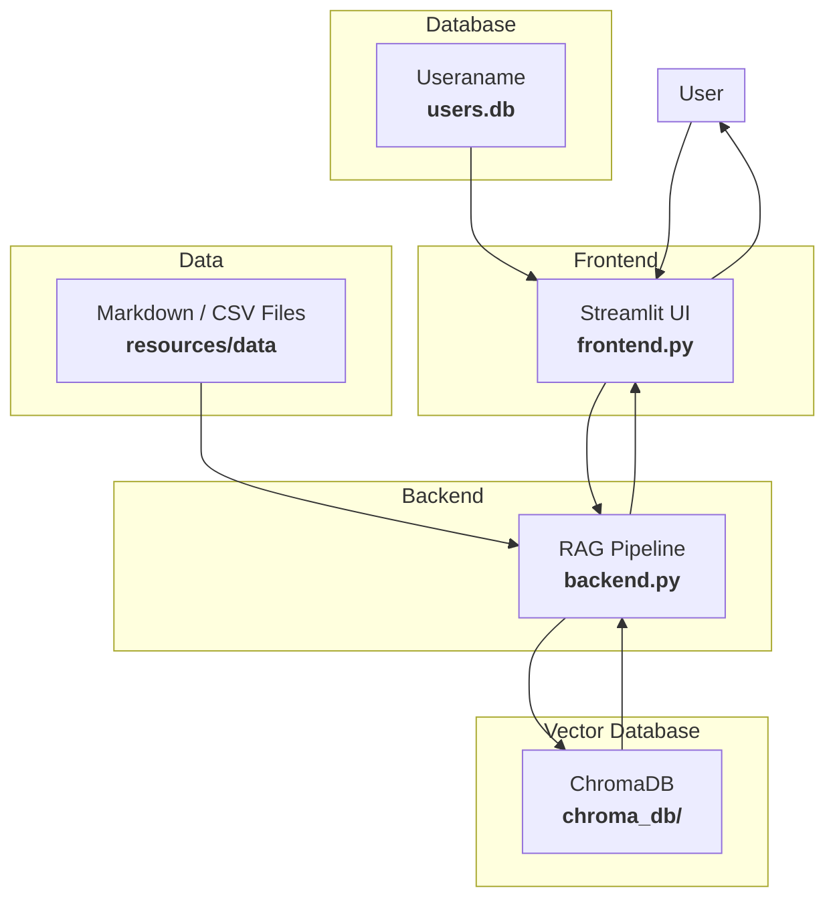

# **ContextGuard**

A secure, intelligent chatbot powered by **LLMs + Vector Search (RAG)** — with **role-based access control (RBAC)** for Finance, HR, Engineering, Marketing, Employees, and C-Level Executives.


## **Problem Background**

**FinSolve Technologies**, a leading FinTech company, was experiencing communication delays and fragmented document access across teams like Finance, HR, Marketing, Engineering, and C-Level Executives. These issues led to slower decision-making and operational inefficiencies, as teams lacked a centralized, secure way to access internal knowledge specific to their roles.


## **Solution Overview**

To address this issue, an internal AI chatbot was developed using Retrieval Augmented Generation (RAG) and Role-Based Access Control (RBAC). It ensures that every user receives accurate, secure, and role-relevant information instantly.

This chatbot solves FinSolve's data access problem using:

- **RAG (Retrieval-Augmented Generation)** via LLaMA model
- **Role-Based Filtering** at the vector search level
- **Streamlit** for interactive chat and login
- **Documents** stored per department with metadata


## **Role-Based Access Control (RBAC)**

| Role               | Permissions                                                                 |
|--------------------|-----------------------------------------------------------------------------|
| C-Level Executives | Full unrestricted access to all documents                                   |
| Finance Team       | Financial reports, expenses, reimbursements                                 |
| Marketing Team     | Campaign performance, customer insights, sales data                         |
| HR Team            | Employee handbook, attendance, leave, payroll                               |
| Engineering Dept.  | System architecture, deployment, CI/CD                                      |
| Employees          | General information (FAQs, company policies, events)                        |


## **Features**

### Secure Role-Based Search
- Each user sees **only** their permitted data
- C-level users get **unfiltered** access

### Interactive Chat Interface
- Built with **Streamlit**
- Login panel with session persistence
- Typing animation + Chat history
- Role access transparency shown in every response

### Context-Aware Retrieval
- Vector DB powered by **Chroma**
- Embeds `.md` files per department with metadata (`role`)
- Queries run through vector similarity → LLM → Answer


## **Tech Stack**

| Layer            | Tool/Library             |
|------------------|--------------------------|
| Frontend         | Streamlit                |
| Embeddings       | SentenceTransformers     |
| Vector DB        | ChromaDB                 |
| LLM              | LLaMA 3 (via Ollama)     |
| Doc Format       | Markdown (.md)           |
| user database    | sqlite                   |


## **Sample Users & Roles**

| Username | Password     | Role              |
|----------|--------------|-------------------|
| Alice    | pass135      | c-levelexecutives |
| Bob      | bobhr093     | hr                |
| Victoria | clarapass234 | finance           |
| David    | davm03       | marketing         |
| Maya     | empass934    | engineering       |
| William  | wilpas301    | marketing         |
| Thomas   | paspo023     | engineering       |
| Jack     | jakepas123   | employee          |


## **Project Architecture**




## **Project Structure**

```
ContextGuard/
├── .venv/
├── app/
│   ├── __pycache__/
│   ├── backend.py
│   └── frontend.py
│
├── chroma_db/
|
├── resources/
│   └── data/
│       ├── engineering/
│       ├── finance/
│       ├── general/
│       ├── hr/
│       └── marketing/
│
├── .env
├── .gitignore
├── .python-version
├── pyproject.toml
├── README.md
├── requirements.txt
├── users.db
└── uv.lock
```


## **Getting Started**

### **Prerequisites**

- Python `3.14+`
- [Streamlit](https://streamlit.io/)
- [LangChain](https://docs.langchain.com/)


### **Setup Instructions**

#### 1. Clone the Repository
```bash
git clone https://github.com/VishwarajsinhKher100/ContextGuard.git
```

#### 2. Create Virtual Environment
```bash
uv venv
```

Activate the virtual environment:

```bash
venv\Scripts\activate     # On Windows
# OR
source venv/bin/activate  # On Mac/Linux
```

Install the dependencies:

```bash
uv add -r requirements.txt
```

#### 3. Add Your API Keys

Make sure to set your `GROQ_API_KEY` in a .env file.

#### 4. Run the Application

To embed documents into ChromaDB (Run Once Before Use):

```bash
python app/backend.py
```

This script:
Loads documents from the data/ folder
Generates embeddings using sentence-transformers
Stores them in ChromaDB with role-based metadata

Once these steps are done, your role-based chatbot is fully set up and ready to use! 

To run streamlit application

```bash
streamlit run app/frontend.py
```


## Extending & Customizing

**Add new roles:**  
- Create a new folder in `resources/data/` named after the new department (e.g., `resources/data/legal/`).
- Add your `.md` documents there.
- Update user credentials and roles in your `frontend.py` or wherever your user-role DB/auth is managed.

**Add new document types:**  
- Extend the file parsing logic inside `app/backend.py` to handle more than `.md` and `.csv` files (like `.pdf`, `.xlsx`, `.docx`, etc.).

**Change embedding model:**  
- Inside `app/backend.py`, change the line where you set:
  ```python
  EMBEDDING_MODEL = "all-MiniLM-L6-v2"
  ```
  to any other `sentence-transformers` model.

**Switch LLM:**  
- Update the `model` name in your code (`app/backend.py`), where you send the prompt to llama model:
  ```python
  llm = ChatGroq(model="llama-3.3-70b-versatile", temperature=0)
  ```
  Replace `"llama-3.3-70b-versatile"` with another models.


## **Query Samples**

1. Give me a summary about system architecture --  Engg
2. Give me the details of employees in Data department whose performance rating is 5 -- HR 
3. What percentage of the Vendor Services expense was allocated to marketing-related activities? -- finance
4. What is the Return on Investment (ROI) for FinSolve Technologies? -- finance 
5. Give me details about leave policies. -- General
6. What was the percentage increase in FinSolve Technologies's net income in 2024? - Finance