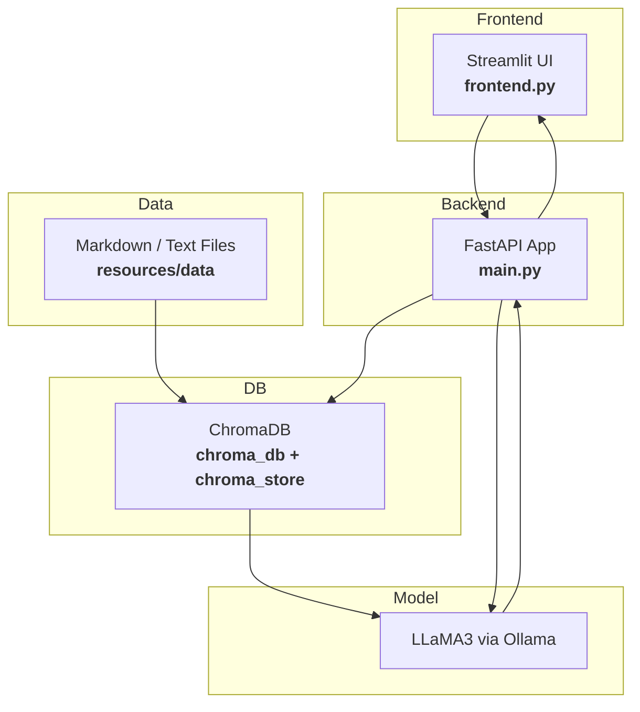

# 🤖 **ContextGuard - AI document assistant - A Role-Based Access Control System**

A secure, intelligent chatbot powered by **LLMs + Vector Search (RAG)** — with **role-based access control (RBAC)** for Finance, HR, Engineering, Marketing, Employees, and C-Level Executives.

---

## 🧩 Problem Background

**FinSolve Technologies**,  a leading FinTech company, was experiencing communication delays and fragmented document access across teams like Finance, HR, Marketing, Engineering, and C-Level Executives. These issues led to slower decision-making and operational inefficiencies, as teams lacked a centralized, secure way to access internal knowledge specific to their roles.

---

## 🧠 Solution Overview
To address this issue, an internal AI chatbot was developed using Retrieval Augmented Generation (RAG) and Role-Based Access Control (RBAC). It ensures that every user receives accurate, secure, and role-relevant information instantly.

This chatbot solves FinSolve's data access problem using:
- 🧠 **RAG (Retrieval-Augmented Generation)** via LLaMA 3 (Ollama)
- 🔐 **Role-Based Filtering** at the vector search level
- ⚡ **Streamlit** for interactive chat and login
- 🧾 **Documents** stored per department with metadata

---

## 👥 Role-Based Access Control (RBAC)

| Role               | Permissions                                                                 |
|--------------------|-----------------------------------------------------------------------------|
| C-Level Executives | Full unrestricted access to all documents                                   |
| Finance Team       | Financial reports, expenses, reimbursements                                 |
| Marketing Team     | Campaign performance, customer insights, sales data                         |
| HR Team            | Employee handbook, attendance, leave, payroll                               |
| Engineering Dept.  | System architecture, deployment, CI/CD                                      |
| Employees          | General information (FAQs, company policies, events)                        |

---

## 🚀 Features

### 🔐 Secure Role-Based Search
- Each user sees **only** their permitted data
- C-level users get **unfiltered** access

### 💬 Interactive Chat Interface
- Built with **Streamlit**
- Login panel with session persistence
- Typing animation + Chat history
- Role access transparency shown in every response

### 🔎 Context-Aware Retrieval
- Vector DB powered by **Chroma**
- Embeds `.md` files per department with metadata (`role`)
- Queries run through vector similarity → LLM → Answer

---

## 🛠 Tech Stack

| Layer         | Tool/Library             |
|---------------|--------------------------|
| Frontend      | Streamlit                |
| Embeddings    | SentenceTransformers     |
| Vector DB     | ChromaDB                 |
| LLM           | LLaMA 3 (via Ollama)     |
| Doc Format    | Markdown (.md)           |

---

## 🧪 Sample Users & Roles

| Username | Password     | Role              |
|----------|--------------|-------------------|
| Alice    | ceopass      | c-levelexecutives |
| Bob      | employeepass | employee          |
| Tony     | password123  | engineering       |
| Bruce    | securepass   | marketing         |
| Sam      | financepass  | finance           |
| Natasha  | hrpass123    | hr                |

---

## 🚀 Project Architecture



## 📁 Project Structure

```
ContextGuard/
├── .venv/
├── app/
│   ├── __pycache__/
│   ├── backend.py
│   └── frontend.py
│
├── chroma_db/
|
├── resources/
│   └── data/
│       ├── engineering/
│       ├── finance/
│       ├── general/
│       ├── hr/
│       └── marketing/
│
├── .env
├── .gitignore
├── .python-version
├── pyproject.toml
├── README.md
├── requirements.txt
└── uv.lock
```

## 📖 Architecture Overview

### **End-to-End Flow:**
#### 1. **User Interface Layer**
* A user enters a question through a **Streamlit UI**.
* This query is sent to the **FastAPI backend**, which handles the core logic.

#### 2. **RAG Agent Path**

* The **RAG Agent** retrieves relevant information from documents using **Vector Search** (e.g., via ChromaDB).
* The LLM then generates a coherent answer from the retrieved chunks.
* The final **RAG-based response** is sent back to the user.

## **Key Features**

### **1. Role-Based Access Control**
* Users are assigned roles (e.g., HR, Finance, QA).
* Each document is tagged with the role it’s meant for.
* Queries are filtered to only retrieve content associated with the user's role.

### **2. Dual Query Handling (RAG + SQL)**
* **Unstructured queries** (e.g., "What are the QA best practices?") → handled by Chroma vector search + LLM.
* **Structured queries** (e.g., "Show me all employees with salary > 100K") → handled via DuckDB.
  
| Mode    | Triggered When              | Engine            |
| ------- | --------------------------- | ----------------- |
| **RAG** | General, text-based queries | Chroma DB + LLM   |
| **SQL** | Structured/tabular queries  | DuckDB SQL engine |


## **3. Why DuckDB for Structured Queries?**
Adopted **DuckDB** for handling structured queries on uploaded CSVs because:

* **In-process SQL engine**: DuckDB runs embedded in Python, no separate server needed.
* **Zero setup**: No configuration required; great for file-based structured queries.
* **Lightweight + Fast**: Efficiently handles large CSV files in memory.
* **Supports Pandas + SQL natively**: Easy to switch between Python dataframes and SQL.
* **Isolated query execution**: Each user session can be sandboxed.

This made DuckDB a perfect fit for answering precise, structured queries over tabular data uploaded by the user.


## **4. Query Classification Module**
A **query classifier** was implemented to determine the intent behind the user's input:

| Intent | Target System | Example Query                     |
| ------ | ------------- | --------------------------------- |
| RAG    | Chroma + LLM  | “Summarize this finance document” |
| SQL    | DuckDB        | “List employees earning over $50k”|

* The classifier directs the query to either:
  * RAG (textual search in vector DB),
  * SQL (execute structured query using DuckDB).
This significantly **improved accuracy and speed**, avoiding LLM overhead when a SQL answer sufficed.

## **5. Fallback Handling Strategy**
In edge cases, a **fallback mechanism** is implemented:
1. If a **SQL query fails** (e.g., malformed, missing table):
   * Log the error,
   * Fallback to the RAG system with rephrased prompt like:
     *"Unable to process SQL. Try answering from available documents instead."*

2. If **no relevant docs** found in RAG:
   * Return a graceful message,
   * Suggest rephrasing or uploading new content.
This ensures the system is **resilient** and never leaves the user with a hard error.

## **6. Reranking with Cohere**
To improve relevance of retrieved documents, added a **Cohere Reranker** in the RAG flow:
* After Chroma vector search retrieves top-k chunks,
* Reranker scores them based on their semantic match with the query,
* Only top-N reranked chunks are passed to the LLM

## **7. Evaluation Framework for RAG (LLM-RAG Eval)**
An **automated evaluation pipeline** to assess output quality. It generates question-answer (QA) pairs from existing documents and evaluates how well the RAG model performs on these questions by comparing the predicted answers against reference answers using LLM-based evaluation.

### Metrics:
* **Faithfulness**: Is the response grounded in retrieved content?
* **Relevance**: Is the answer contextually appropriate?
* **Conciseness**: Is it direct and non-redundant?

### How it works:
* Collect query-response pairs during usage
* Run them through an **OpenAI or LLM-based evaluator**
* Store per-metric scores in CSV for further analytics
* Used to compare performance with/without reranker and classifier


## **8. Automation Testing**
### **Backend API Testing – Pytest**
* FastAPI endpoints (`/chat`, `/upload`, `/login`, etc.) tested using `TestClient`
* Verified classifier routing, SQL execution, RAG fallback logic

### **Frontend Testing – Playwright**
* End-to-end tests for **Streamlit UI**:
  * Login flow
  * Role-based tab rendering
  * Document upload
  * Query submission and output display

* **Video recording** enabled for demo and review

## **Tech Stack**
 * AI/LLM: OpenAI GPT-4o, LangChain
 * Backend: FastAPI, SQLite, DuckDB
 * Frontend: Streamlit
 * Vector DB: Chroma DB
 * File Support: Markdown, CSV
 * Access Control: RBAC
 * Testing: Pytest, Playwright

## **Future Enhancements**
* Support **admin analytics dashboard** (e.g., query types, usage).
* Add **table+text hybrid retrieval** (RAG with tabular fusion).
* Caching of SQL queries for repeated execution.

## **Conclusion**
This project delivers a **production-ready RAG system** with:
* Role-based access,
* Dual-mode intelligent query routing,
* Reranking for precision,
* Automated evaluation and testing at every layer.

This RAG system demonstrates a **flexible, intelligent retrieval pipeline** that dynamically routes user queries to either unstructured (LLM-based) or structured (SQL-based) engines. The use of **DuckDB**, **query classification**, and **fallback design** has led to a robust solution that balances performance, explainability, and adaptability. With strong modularity and extensibility it’s an ideal architecture for real-world enterprise AI assistants where both document knowledge and structured analytics are needed in one place

## 📸 Screenshots

## RAG Architecture

## 🚀 Getting Started

### 📦 Prerequisites

- Python `3.14+`
- [Streamlit](https://streamlit.io/)
- [LangChain](https://docs.langchain.com/)

---

### **Quick Start**

## 1. Clone the Repository
```bash
git clone https://github.com/VishwarajsinhKher100/ContextGuard.git
```

## 2. Install Dependencies
```bash
pip install -r requirements.txt
```

## 3. Add Your API Keys
Make sure to set your `GROQ_API_KEY` in a .env file.

## 4. Run the Application
```bash
streamlit run app/frontend.py
```
---

### Detailed Overview 

## 🔒 1️⃣ User Authentication
User enters Name & Password in Streamlit frontend.

Frontend sends credentials to User Access Control DB via RAG Backend API.

API validates credentials and retrieves role-based permissions.

On success → User redirected to main chat interface.

## 💬 2️⃣ Chat Query Submission
User types a query in the Streamlit Chat UI.

Query sent to RAG Backend.

## 🔍 3️⃣ Contextual Retrieval (RAG Flow)
API uses role information from Access DB.

API sends query and role context to Vector Database (FAISS/Chroma).

Vector DB performs similarity search on relevant documents.

Top relevant results are retrieved as contextual passages.

## 🤖 4️⃣ AI Response Generation
Retrieved passages and user query passed to LLM (OpenAI/GPT-4 or equivalent) via LangChain RAG pipeline.

LLM generates a contextual, role-filtered answer.

API returns response to the Streamlit UI.

### 📌 Use Cases
Here’s where and how ContextGuard AI can be valuable in a Tech enterprise setting:

✅ Employee Self-Service Helpdesk:
Employees instantly resolve HR, Finance, or IT-related queries without waiting for human support.

✅ HR Process Automation:
Provide onboarding, leave policies, benefits, payroll, and grievance resolution support through role-based access.

✅ Finance Department Q&A:
Handle employee questions about reimbursements, tax declarations, financial compliance, or budget processes.

✅ Marketing Team Assistance:
Answer FAQs on campaign performance, brand guidelines, and lead generation processes.

✅ Technical Support Automation:
Help engineers and IT staff resolve technical queries about deployment pipelines, code repositories, or data policies.

✅ Compliance & Risk FAQs:
Provide controlled, up-to-date regulatory guidelines and policies based on user role.

✅ Internal Knowledge Management:
Serve as a role-aware AI assistant for accessing internal SOPs, manuals, and policy documents.

✅ Analytics Reporting for Managers:
Department heads can monitor query trends, peak hours, and department activity with real-time analytics.

---
### ⚙️ How It Works
A step-by-step breakdown of how FinSolve AI functions internally:

1️⃣ User Login:
Employees log in using their name and password. The system verifies credentials via the User Access Control DB and retrieves their assigned role (e.g., HR, Finance, Tech, Marketing).

2️⃣ Role-Based Dashboard:
Post-login, users access a personalized chat interface with role-specific query suggestions and restricted access to internal documents.

3️⃣ Query Submission:
The user submits a question via the chat UI. The query is sent to the RAG-powered Backend API.

4️⃣ Context Retrieval (RAG):
The backend fetches the employee’s role and retrieves relevant internal documents or FAQs from a Vector Database (like FAISS/Chroma) using similarity search.

5️⃣ AI Response Generation:
The retrieved documents and the original query are sent to a large language model (e.g., GROQ via LangChain). The LLM generates a contextually accurate, role-filtered response.

6️⃣ Response Delivery:
The AI-generated response is returned to the Streamlit chat UI, displayed instantly to the employee.

---

## **Query Samples**
1. Give me a summary about system architecture --  Engg
2. Give me the details of employees in Data department whose performance rating is 5 -- HR 
3. What percentage of the Vendor Services expense was allocated to marketing-related activities? -- finance
4. What is the Return on Investment (ROI) for FinSolve Technologies? -- finance 
5. Give me details about leave policies. -- General
6. What was the percentage increase in FinSolve Technologies's net income in 2024? - Finance